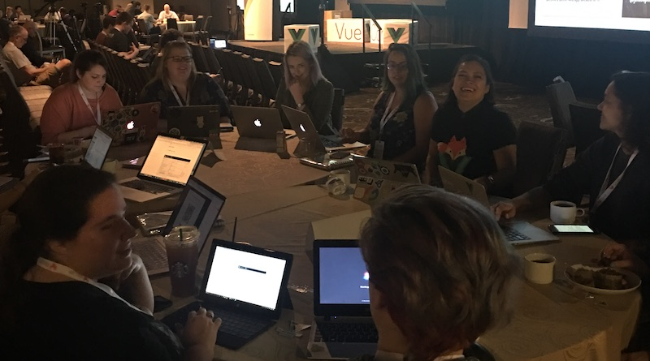

# Sobre os Workshops Vue Vixens

Vue Vixens é uma iniciativa criada por Jen Looper, uma Senior Developer Advocate na [Progress](http://www.progress.com), criadores do NativeScript, Kendo UI, Open Edge, e outros. A missão das Vue Vixens é criar workshops para ensinar Vue.js de uma forma legal e divertida para 'pessoas que se identificam como mulheres'. É baseada no modelo pioneiro de sucesso criado por Shmuela Jacobs para a comunidade de Angular, [http://www.ng-girls.org](ng-girls.org). Ng-Girls foi, por sua vez, inspirado pelas iniciativas Rails Bridge e Django Girls.

::: tip Não são apenas workshops!
Nós fazemos mais do que workshops! Nós também podemos ajudar com as iniciativas de diversidade da sua conferência - entre em contato conosco em [info@vuevixens.org](mailto:info@vuevixens.org).
:::

Estes workshops foram desenhados para ajudar pessoas a conhecerem melhor Vue.js e NativeScript-Vue, uma implementação do Vue.js que permite que desenvolvedores criem apps mobile nativos usando Vue. 3/4 de um workshop padrão é focado em web, e 1/4 é focado em mobile. Abaixo há uma entrevista com Jen e Evan You, criador Vue, e Igor Randjelovic, criador do NativeScript-Vue, falando sobre o contexto e história dos projetos.

<iframe width="560" height="315" src="https://www.youtube.com/embed/jFsmrudIFmI" frameborder="0" allow="autoplay; encrypted-media" allowfullscreen></iframe>

- - -

## FAQ

**Qual a diferença entre um Capítulo e um 'Mini'?**

Esses capítulos são apresentados como dois tipos distintos. Os primeiros cinco capítulos fazem parte de um workshop que ocupa um dia inteiro. Outros capítulos são listados como 'mini-workshops' e podem ser feitos com alguma finalidade específica com grupos em meetups, sessões durante o almoço ou durante o café da manhã. Nós estamos contínuamente adicionando conteúdo nessa área.

**Por que os capítulos são quebrados em partes?**

Todos os codelabs online são projetados para serem concluídos em grupos, em um modo de estudo individual, em um formato de workshop durante meetups, conferências ou eventos mais rápidos. Para as oficinas de um dia inteiro, é melhor dividir o dia em partes e reagrupar os usuários periodicamente para que nenhum membro seja deixado para trás. Se uma participante se perder, ela poderá "reinicializar" baixando o ponto final de cada capítulo anterior em um novo Code Sandbox.

**Onde posso me increver para um skulk?**

As participantes do workshop e mentores podem se registrar para eventos em [http://www.vuevixens.org](vuevixens.org). Fique de olho no nosso feed do Twitter @vuevixens para anúncios dos próximos eventos. Os workshops Vue Vixens são gratuitos, mas dependem do orçamento de conferências e encontros para oferecer almoço, café da manhã ou lanches, além de um espaço com wi-fi.

**Sou um homem. Posso participar?**

O objetivo do programa é familiarizar as mulheres e pessoas que se identificam como tal com conceitos de programação para web e dispositivos móveis usando o Vue.js em um ambiente de apoio e inclusão. Os desenvolvedores experientes do Vue, no entanto, são muito bem-vindos para participar de nossos esforços para organizar eventos, apoiar nosso fundo de bolsas de estudo, orientar um evento e fornecer conteúdo. Somos gratos por todos os tipos de ajuda!

> O Skulk inaugural das Vue Vixens na Vue.US Conference em New Orleans, Março de 2018

## Conteúdo do Workshop

- Capítulo 1: Introduzindo a interface da Pet Shop – acendendo as luzes!
  - Usando variáveis de CSS, crie um switch em uma página que irá acender as luzes da sua loja (trocando o tema da página). Introdução básica a estrutura do nosso projeto
- Capítulo 2: Construa uma Galeria de Pets
  - Usando dados estáticos, crie uma interface para mostrar o animal com nome e imagem, usando cards
- Capítulo 3: Conecte a uma API
  - Troque sua interface estática por uma dinâmica usando a API Dog CEO: [https://dog.ceo/dog-api/](https://dog.ceo/dog-api/)
- Capítulo 4: Crie uma experiência de adoção
  - Crie uma 'lista de favoritos' para a loja, onde você possa adicionar e remover um animal
- Capítulo 5: Complete a experiência com um Formulário
  - Crie um formulário funcional para adotar um animal
- Capítulo 6: Levando pro mobile
  - Crie o 'Tindogs', um app para navegar através de um deck de imagens de animais. Esse app será construído no NativeScript Playground

- - -

### Obrigada às nossas Contribuidoras!

 | |
:---: |:---: |
[Natalia Tepluhina](https://github.com/NataliaTepluhina) |[Jen Looper](https://github.com/jlooper)
