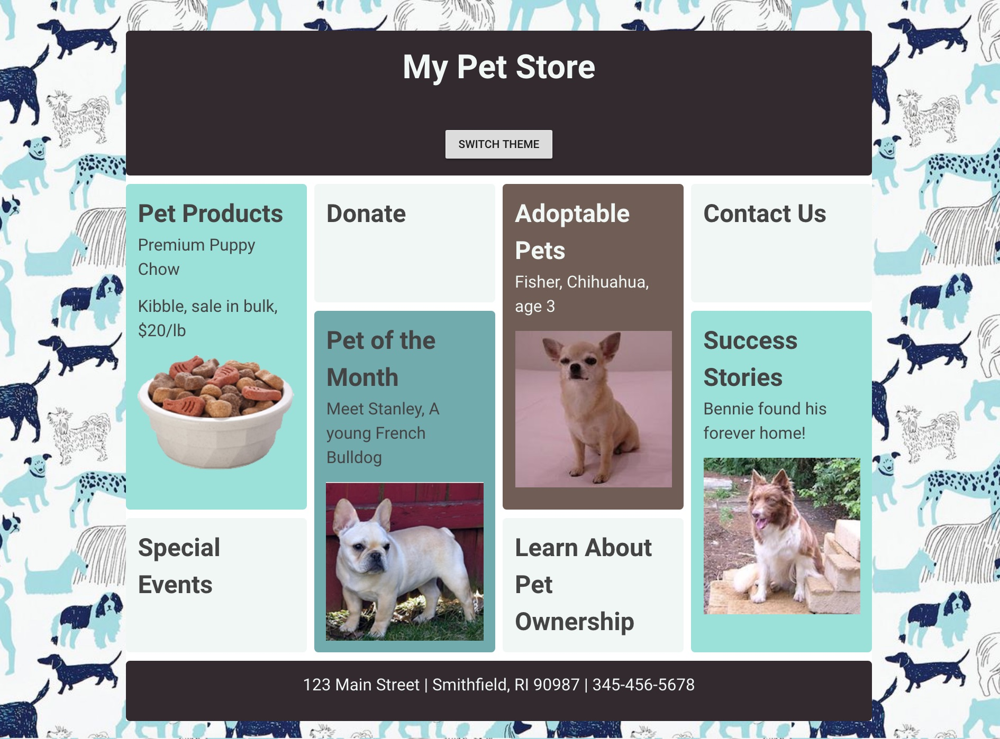

# 📋 Capítulo 1: Apresentando a "My Pet Shop Web App"

| **Objetivo do projeto**| Ter o primeiro contato com Vue.js, criando uma aplicação estática para uma Pet Shop|
| --------------------------- | -------------------------- |
| **O que você irá aprender**| Configurar sua aplicação Vue, utilizar CSS Grid, estilizar sua aplicação, preparar a estrutura do seu código para seguirmos adiante.|
| **Ferramentas que você irá usar**| Um navegador moderno como o Google Chrome. Caso esteja usando o Chrome, instale a extensão Vue.js DevTools. Uma conta em CodeSandbox.io. |
| **Tempo estimado** | 1/2 hora|

## Instruções

Como esse é o primeiro projeto em Vue.js que vamos fazer, começaremos do zero no [Code Sandbox](http://codesandbox.io). Crie uma conta do Code Sandbox e inicialize um modelo em Vue.js clicando [aqui](https://codesandbox.io/s/vue).

Nós vamos construir uma loja para um Pet Shop fictício que ficará assim:



Além disso, vamos criar um botão que mudará a aparência da loja para se assemelhar a isso:


Dê uma olhada no código que foi criado pelo Code Sandbox. O primeiro arquivo que você verá é aberto por padrão: `main.js`. Este é o principal ponto de partida de uma aplicação Vue.js. Note que neste arquivo você importa o Vue do pacote npm: `import Vue from "vue";`. O Code Sandbox importa todas as dependências necessárias do npm para construir o aplicativo; você sempre pode verificar o arquivo `package.json` para descobrir quais dependências são necessárias.

O `main.js` também inicializa a aplicação como uma nova instância Vue.js e define a div na qual o código do aplicativo será injetado. Ele também nomeia o componente principal e define o nome do modelo:

```js
new Vue({
  el: "#app",
  components: { App },
  template: "<App/>"
});
```

Abra o arquivo `App.vue`. Neste arquivo, o componente 'home' é construído. Ele contém as três partes principais de um Componente de Arquivo Único (Single File Component, ou SFC) do Vue.js: um template, um bloco de script e um bloco de estilo.

Observe que a primeira div no template tem o id 'app' - essa é a div em que o código do aplicativo será injetado. Há também um componente `<HelloWorld>` incluído abaixo da imagem do logotipo. Este é um exemplo de um SFC sendo incluído no `App.vue`.

Abra `components/HelloWorld.vue` e você encontrará a origem da lista de links que aparece incorporada no `App.vue`. Este arquivo também inclui um bloco de script com uma variável `msg` e mais alguns estilos em um bloco `<style>`.

Vamos remover este aplicativo de exemplo e recriá-lo! Vamos começar!

## Criando os Estilos

Vamos começar no arquivo `App.vue`, já que não precisamos fazer nenhuma alteração no `main.js`. Adicione o seguinte bloco de estilo na parte inferior do arquivo, substituindo o atual bloco `<style scoped>`:

```scss
	<style lang="scss">
	@import url("https://fonts.googleapis.com/css?family=Roboto");

	/*brown and mint*/
	/*dark brown 32292F
	light mint 99E1D9
	bisque F0F7F4
	dark mint 70ABAF
	light brown 705D56*/

	*,
	*:before,
	*:after {
	  box-sizing: border-box;
	}

	body {
	  margin: 0;
	  padding: 0;
	}

	main {
	  padding: 40px;
	  font-family: "Roboto", "sans-serif";
	  background: #fff top center repeat;
	  color: #444;
	  background-image: url("https://raw.githubusercontent.com/VueVixens/projects/master/petshop/images/bg.jpg");
	}

	h1,
	p {
	  margin: 0 0 1em 0;
	}

	img {
	  max-width: 100%;
	  display: block;
	  margin: 0 auto;
	}

	.app-container {
	  max-width: 940px;
	  margin: 0 auto;
	  background-color: #fff;
	}

	.app-container > * {
	  border-radius: 5px;
	  font-size: 150%;
	  margin-bottom: 10px;
	}

	.wrapper {
	  display: grid;
	  grid-gap: 10px;
	  grid-template-columns: repeat(auto-fill, minmax(200px, 1fr));
	  grid-auto-rows: minmax(150px, auto);
	}

	.wrapper > * {
	  padding: 15px;
	  border-radius: 5px;
	}

	.light-mint {
	  background-color: #99e1d9;
	}

	.dark-mint {
	  background-color: #70abaf;
	}

	.light-brown {
	  background-color: #705d56;
	  color: #f0f7f4;
	}

	.dark-brown {
	  background-color: #32292f;
	  color: #f0f7f4;
	}

	.bisque {
	  background-color: #f0f7f4;
	}

	/*orange and green*/
	/*
	dark orange 771100
	orange CC6633
	light orange FF9900
	dark green 689980
	light green 86a193
	*/

	.orange-green {
	  background-image: url("https://raw.githubusercontent.com/VueVixens/projects/master/petshop/images/bg2.jpg");
	  .light-mint {
	    background-color: #86a193;
	  }

	  .dark-mint {
	    background-color: #689980;
	  }

	  .light-brown {
	    background-color: #cc6633;
	  }

	  .dark-brown {
	    background-color: #771100;
	  }

	  .bisque {
	    background-color: #ff9900;
	  }
	}

	.panel {
	  /* needed for the flex layout*/
	  margin-left: 5px;
	  margin-right: 5px;
	  flex: 1 1 200px;
	}

	.tall-panel {
	  grid-row-end: span 2;
	}

	.app-header,
	.app-footer {
	  flex: 0 1 100%;
	  padding: 15px;
	  text-align: center;
	}

	/* We need to set the margin used on flex items to 0 as we have gaps in grid.  */
	@supports (display: grid) {
	  .wrapper > * {
	    margin: 0;
	  }
	}
	</style>
```

::: Dica 💡
Note que não usamos `<scoped>` como parte do bloco de estilo. A palavra-chave "scoped" define que seus estilos permanecerão válidos apenas para o componente atual, mas nós queremos fazer esses novos estilos universais. Nós especificamos que estamos usando o Sass, utilizando `lang="scss"`, um método para tornar seu css mais fácil de gerenciar. Saiba mais [aqui](http://www.sass-lang.com).
:::

Este bloco de estilo inclui algumas coisas surpreendentes:

- Ele usa caminhos para imagens externas hospedadas no Github, em vez de caminhos relativos. Isso ocorre porque o Code Sandbox não hospeda imagens - normalmente você apenas adiciona uma imagem em uma pasta e adiciona ao projeto com um caminho relativo como `/images/myImage.png`.
- Esse CSS e o template que criaremos fazem uso do CSS Grid, uma nova maneira de criar layouts de "mosaico" flexíveis e responsivos como este, com blocos de conteúdo empilhados. Saiba mais sobre o CSS Grid [aqui](https://css-tricks.com/snippets/css/complete-guide-grid/).
- Existem duas variações de estilo! Um tem o tema verde, o outro é laranja. Nós vamos fazer uso disso em breve.

Adicionar a declaração de estilo não mudou muito no nosso template, exceto fazer os elementos `<li>` parecerem estranhos. Vamos consertar o template!

## Instalando o Vuetify

Antes de editarmos o modelo, vamos instalar o Vuetify. O Vuetify é uma biblioteca bacana que aplica o [Material Design](https://material.io/design/) aos seus aplicativos Vue. Neste capítulo, vamos usá-lo apenas para criar um botão, mas vamos usá-lo mais em capítulos futuros.

::: tip 💡
Vuetify é um framework de componentes para o Vue. O objetivo é fornecer componentes limpos, semânticos e reutilizáveis ​​para criar sua aplicação. Você pode encontrar toda a documentação [aqui](https://vuetifyjs.com/en/getting-started/quick-start)
:::

Para instalá-lo, clique no botão "Adicionar dependência" no dropdown "Dependências" à esquerda no Code Sandbox. Pesquise por 'Vuetify' e instale-o.

Verifique se a dependência está instalada abrindo o `package.json` e verificando o objeto "dependencies". Deve ficar assim:

```json
"dependencies": {
  "vue": "^2.5.2",
  "vuetify": "1.0.17"
},
```

A seguir, inicialize o Vuetify abrindo o arquivo `main.js` e acrescentando estas linhas abaixo do segundo `import`:

```js
import Vuetify from "vuetify";

Vue.use(Vuetify);
```

Isso garante que os temas e componentes do Vuetify estejam disponíveis em toda aplicação Vue.

Em seguida, sobrescreva o modelo atual em `App.vue` com esta marcação:

```html
<template>
  <v-app>
    <main>
      <div class="app-container">
        <header class="app-header dark-brown">
          <h1>My Pet Store</h1>
        </header>
        <div class="wrapper">
          <div class="panel tall-panel light-mint">
              <h2>Pet Products</h2>
              <p>Premium Puppy Chow</p>
              <p>Kibble, sale in bulk, $20/lb</p>
              
          </div>
          <div class="panel bisque">
              <h2>Donate</h2>
          </div>
          <div class="panel tall-panel light-brown">
              <h2>Adoptable Pets</h2>
              <p>Fisher, Chihuahua, age 3</p>
              
          </div>

          <div class="panel bisque">
              <h2>Contact Us</h2>
          </div>
          <div class="panel tall-panel dark-mint">
              <h2>Pet of the Month</h2>
              <p>Meet Stanley, A young French Bulldog</p>
              
          </div>
          <div class="panel tall-panel light-mint">
              <h2>Success Stories</h2>
              <p>Bennie found his forever home!</p>
              
          </div>

          <div class="panel bisque">
              <h2>Special Events</h2>
          </div>

          <div class="panel bisque">
              <h2>Learn About Pet Ownership</h2>
          </div>
        </div>
        <footer class="app-footer dark-brown">
          <p>123 Main Street | Smithfield, RI 90987 | 345-456-5678</p>
        </footer>
      </div>
    </main>
  </v-app>
</template>
```

Uau, isso deu uma grande diferença! De repente, agora você tem uma loja!

::: Dica 💡
Observe o uso da tag `<v-app>` - este é um requisito do Vuetify e é um sinal de que você terá um aplicativo com um tema do Vuetify.
:::

Agora vamos realmente usar esse tema do Vuetify criando um switch (um botão com dois estados). Pressionar esse botão acionará uma mudança de tema para o tema "laranja" que viu nos estilos.

- Temos a classe `orange-green` no nosso CSS. Vamos adicioná-la ao elemento `<main>` e observar como todas as cores e o plano de fundo são alterados:
    ```html
    <main class="orange-green">
    ```
- Agora vamos tentar mudar a classe usando as interligações do Vue. Substitua essa classe simples em `<main>` por uma interligação dinâmica:

```html
<main :class="{'orange-green': false}">
```

Experimente trocar `false` para `true` e vice-versa. Você pode ver como a classe é aplicada na extensão Vue.js DevTools no Chrome e como o tema de cores da página está mudando.

- Agora é hora de criar sua primeira variável Vue. Primeiro, você precisa adicionar `data ()` ao seu componente Vue. Esta função deve retornar um objeto de nossas variáveis ​​Vue. Vamos criar um no bloco `<script>`. Sobrescreva o bloco `<script>` atual:

```js
<script>
export default {
  name: "App",
  data() {
    return {
      themeSwitched: false
    };
  }
};
</script>
```

::: dica 💡
Neste ponto, você pode remover o componente `HelloWorld.vue` da pasta `views`, já que não precisaremos mais dele.
:::

Então, agora você tem uma variável chamada `themeSwitched` e seu valor padrão é `false`.

- Na tag `<main>`, substitua `false` na interligação de classe pela nossa variável recém-criada:

```html
<main :class="{'orange-green': themeSwitched}">
```

- Altere o valor da variável `themeSwitched` dentro de `data` de `false` para `true`. Mais uma vez, você pode ver o efeito de mudança de cor.

- Agora só precisamos de um "interruptor" para mudar o tema. Primeiro vamos criar um botão (iremos utilizar o Vuetify para isso). Vamos colocá-lo no cabeçalho logo após a tag `h1`:

```html
<header class="app-header dark-brown">
    <h1>My Pet Store</h1>
    <v-btn>Switch theme</v-btn>
</header>
```

- Agora vamos adicionar um manipulador de eventos de clique ao nosso botão. Podemos usar a diretiva `v-on` ou seu atalho `@ `. Este manipulador irá trocar o valor de `themeSwitched`, alternando a classe de mudança de cor.

    ```html
    <v-btn @click="themeSwitched = !themeSwitched">Switch theme</v-btn>
    ```

Você deve ter notado que o botão parece um pouco pequeno. Para corrigir isso, adicione o CSS específico do Vuetify em `index.html`:

```html
<link rel="stylesheet" href="https://unpkg.com/vuetify@1.0.9/dist/vuetify.min.css">
<link href='https://fonts.googleapis.com/css?family=Roboto:300,400,500,700|Material+Icons' rel="stylesheet">
```

Teste seu aplicativo clicando no botão. Bem legal, não?

**Parabéns! Você acabou de terminar o capítulo 1!**

# Resultado final


