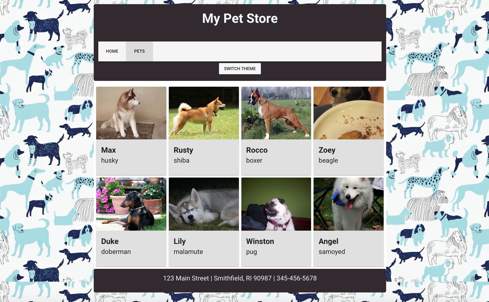

# 📋 Capítulo 2: Construindo uma galeria de pets

| **Objetivo do projeto**| Aprender como manipular dados em uma aplicação web.|
| --------------------------- | -------------------------- |
| **O que você irá aprender**| Usando dados estáticos, você construirá uma interface com cards para mostrar cães para adoção.|
| **Ferramentas que você irá usar**| Um navegador moderno como o Google Chrome. Caso esteja usando o Chrome, instale a extensão Vue.js DevTools. Uma conta em CodeSandbox.io. |
| **Tempo estimado** | 1 hora|

## Instruções

Se você precisar reiniciar seu projeto, clone [este repositório](https://github.com/VueVixens/projects/tree/master/chapter-1-end) no Code Sandbox após efetuar login.

Neste ponto temos apenas uma página inicial, mas queremos adicionar mais uma página para conter os cards com animais animais de estimação. Vamos criar uma aplicação de uma única página (uma SPA) com uma barra de navegação listando "home" e "pets". Clicar na página "pets" nos levará à nova página que estamos criando agora.

::: dica 💡
Um aplicativo de página única (em inglês "single-page application", ou SPA) é uma aplicação web ou site que consiste de uma única página web (...). Em um SPA, todo o código necessário - HTML, JavaScript, e CSS – ou é obtido com um único carregamento de página, ou os recursos apropriados são carregados dinamicamente e adicionados à página conforme necessário, geralmente em resposta a ações do usuário. A página não é recarregada em qualquer momento do processo, tampouco ocorre a transferência de controle para outra página, embora a URL no navegador ou a API de história do HTML5 possam ser usadas para fornecer a percepção e navegabilidade de páginas separadas ao aplicativo.

" ([Wikipedia](https://en.wikipedia.org/wiki/Single-page_application))
:::

Para criar nosso SPA com o Vue, precisamos usar o [vue-router](https://github.com/vuejs/vue-router). O vue-router é o roteador oficial do Vue (umaa biblioteca que facilita a movimentação de uma página para outra). Ele é especificamente projetado para funcionar com SPAs que possuem alguns requisitos especiais, como rotas aninhadas e passagem de dados pelo roteador. Adicione-o às dependências do seu aplicativo (clique no botão `Add Dependency` e procure por `vue-router`), e instale-o (como fizemos anteriormente com o Vuetify).

## O Roteador

Abra o arquivo `main.js` e importe o vue-router:

```js
import VueRouter from 'vue-router';
```

Agora nós precisamos usar o plugin no método global `Vue.use()`:

```js
Vue.use(VueRouter);
```

::: tip 💡
Pare e pense sobre a arquitetura do nosso aplicativo. Em nosso aplicativo, o cabeçalho e o rodapé estarão presentes em cada página e o conteúdo entre eles será alterado. Para conseguir isso, o componente correspondente da rota será renderizado dentro de uma tag `<router-view>`. Precisaremos então tirar todas as nossas partes de dentro do arquivo App.vue, então vamos fazer algumas refatorações.
:::

## Criando a Home Page

Vamos criar um componente separado para todos os elementos contidos na `<div class="wrapper">`.

- Vá para a pasta `views` em `src` (crie-a se ela não existir) e crie um arquivo chamado `Home.vue`.

- Adicione a tag `<template></template>` para este novo arquivo.

- Vá para o arquivo `App.vue`. Copie o elemento `<div class="wrapper">` e todos os elementos dentro dele e cole-os dentro do template em `Home.vue`. Este é todo o código entre as tags `<header>` e `<footer>`. Exclua esse código do `App.vue`.

## Criando a página de Pets

Agora vamos criar uma página `Pets.vue`. Em `src/views`, como você fez para a página `Home.vue`, crie um arquivo `Pets.vue`. Adicione um layout que use o estilo de cards do Vuetify:

```html
<template>
  <v-container grid-list-md fluid>
    <v-layout wrap>
      <v-flex xs12 sm4 md3>
        <v-card color="grey lighten-2">
          <v-img src="https://goo.gl/6CQNDo" height="170px">
          </v-img>
          <v-card-title>
            <div>
              <h3>Looking for a dog?</h3>
            </div>
          </v-card-title>
        </v-card>
      </v-flex>
    </v-layout>
  </v-container>
</template>

<style scoped>
p {
  margin: 0;
}
</style>
```

## Adicionando as Rotas

Ótimo, agora temos componentes separados para nossa página incial e a página de pets! Você notará, no entanto, que o conteúdo ainda não é exibido no aplicativo. Temos que fazer rotas para essas páginas.

- Vamos voltar ao arquivo `main.js`. Primeiro, vamos importar nossos novos componentes na lista de importações no topo:

```js
import Home from './views/Home';
import Pets from './views/Pets';
```

- Agora podemos criar rotas. Cada rota é um objeto que especifica um caminho e um componente que será processado nesse caminho. Vamos adicionar duas rotas: uma é para nossa homepage e outra para animais de estimação. Adicione este código antes das linhas `Vue.use...`:

```js
const routes = [
  { path: '/', component: Home },
  { path: '/pets', component: Pets },
];
```

- Agora temos que criar uma instância do `VueRouter` e passar o nosso objeto de rotas para ela. Adicione esta linha abaixo do objeto `const routes` que você acabou de colar:

```js
const router = new VueRouter({ routes });
```

- Finalmente, precisamos adicionar o roteador à nossa instância do Vue. Para fazer isso, basta adicionar uma referência ao `router` logo após astring `template: '<App />'`:

```js
new Vue({
  el: '#app',
  components: { App },
  template: '<App/>',
  router,
});
```

- Agora abra o `App.vue`. Substitua todo o trecho `<div class=" wrapper">` que você removeu por uma tag `<router-view> </ router-view>`, colocando-o entre o cabeçalho e o rodapé. Sua loja acabou de voltar à vida!

Teste seu progresso. Adicione `/pets` no final da URL na barra de endereço. Agora você pode ver o componente Pets em vez de Home!

## Adicionando Navegação

Para tornar nossa navegação mais fácil, criaremos uma barra de navegação simples usando o Vuetify, que já implementamos no Capítulo 1.

O componente da barra de ferramentas no Vuetify é chamado `v-toolbar`. Vamos adicioná-lo logo abaixo da tag `h1` no nosso cabeçalho:

```html
<v-toolbar>
    <v-toolbar-items>
        <v-btn to="/" flat>Home</v-btn>
        <v-btn to="/pets" flat>Pets</v-btn>
    </v-toolbar-items>
</v-toolbar>
```

Você pode ver dois botões nesta barra de ferramentas. Cada um deles tem um atributo `to`: é um link do roteador para uma determinada rota. Agora podemos alternar facilmente entre as páginas. Experimente clicar nos botões.

Ok, tudo bem, mas não há animais de estimação, então vamos adicionar alguns!

## Criando alguns dados

Nós vamos adicionar alguns dados fictícios em uma nova pasta chamada `data`. Crie essa pasta em `src` e adicione um arquivo em branco chamado `dogs.js`. Cole no seguinte objeto json:

```js
export const Dogs = [
  {
    name: 'Max',
    breed: 'husky',
    img: 'https://dog.ceo/api/img/husky/n02110185_1469.jpg',
  },
  {
    name: 'Rusty',
    breed: 'shiba',
    img: 'https://dog.ceo/api/img/shiba/shiba-13.jpg',
  },
  {
    name: 'Rocco',
    breed: 'boxer',
    img: 'https://dog.ceo/api/img/boxer/n02108089_14112.jpg',
  },
  {
    name: 'Zoey',
    breed: 'beagle',
    img: 'https://dog.ceo/api/img/beagle/n02088364_11136.jpg',
  },
  {
    name: 'Duke',
    breed: 'doberman',
    img: 'https://dog.ceo/api/img/doberman/n02107142_4653.jpg',
  },
  {
    name: 'Lily',
    breed: 'malamute',
    img: 'https://dog.ceo/api/img/malamute/n02110063_1104.jpg',
  },
  {
    name: 'Winston',
    breed: 'pug',
    img: 'https://dog.ceo/api/img/pug/n02110958_15626.jpg',
  },
  {
    name: 'Angel',
    breed: 'samoyed',
    img: 'https://dog.ceo/api/img/samoyed/n02111889_4470.jpg',
  },
];
```

Esse arquivo exporta uma `const` chamada `Dogs`, contendo todos os dados que precisamos.

- Vamos importar esses dados para o nosso componente de animais de estimação. Vá para o arquivo `Pets.vue` e adicione o seguinte bloco de script abaixo do bloco `<template>`. Esta tag importa os dados do arquivo Dogs:

```js
<script>import {Dogs} from "../data/dogs";</script>
```

Agora temos que adicionar esses dados à propriedade `data` do nosso componente. Edite a tag `<script>`:

```js
<script>
  import { Dogs } from "../data/dogs";
  export default {
    data() {
      return {
        dogs: Dogs
      };
    }
   };
  </script>
```

Este script garante que o array `dogs` faça parte do estado do componente `Pets` e possa ser usado em nosso template.

## Anexando os dados a uma lista

Agora queremos fazer uma lista de cachorros. A maneira mais fácil de fazer isso é percorrer um array e acrescentar dados a uma lista. Nossa propriedade `Dogs` é um array, então está pronta para ser usada. Para renderizar uma lista de itens baseados em um array, o Vue possui uma diretiva `v-for`, que irá percorrer este array e renderizar cada item. Vamos adicionar essa diretiva ao nosso elemento `v-flex` em `Pets.vue`:

```html
<v-flex xs12 sm4 md3 v-for="pet in dogs" :key="pet.breed">
```

Para fazer um loop e anexar corretamente os dados, você precisa fornecer um atributo `key` exclusivo para cada item. No nosso caso, a raça do cachorro será a chave.

Você pode ver agora que temos oito `v-cards` com o mesmo texto e imagem. Vamos consertar isso!

Dentro do elemento com a diretiva `v-for`, nosso cão será chamado `pet`.

::: tip 💡
Lembre-se, escolhemos esse nome dentro da diretiva; se tivéssemos escrito `v-for="dog in dogs` cada item seria chamado `dog`.
:::

Verificando o arquivo `dogs.js` podemos ver que cada cão tem 3 propriedades: name, breed e img. Vamos mostrar a imagem dentro do componente `v-img`.

Mas se simplesmente substituirmos o valor de `src` por `pet.img`...

```html
<v-img src="pet.img" height="170px">
```

Nós não teremos fotos. Por quê? Porque estamos tentando passar um valor estático, algum arquivo chamado `pet.img` e não existe tal arquivo nestes dados. Para ligar atributos dinamicamente, precisamos de uma diretiva `v-bind` ou seu atalho `:`.

```html
<v-img :src="pet.img" height="170px">
```

::: tip 💡
A diretiva `v-bind` vincula dinamicamente um ou mais atributos, ou uma propriedade de um componente a uma expressão em javascript. Aquela pequena `:` faz toda a diferença!
:::

Agora funciona!

Agora temos que mostrar o nome do cachorro. Para texto, o Vue usa uma sintaxe chamada _"mustache"_- chaves duplas como estas: `{{ }}`. A tag entre chaves será substituída pelo valor da propriedade. Edite a tag `<h3>` para usar chaves e coloque o nome do cachorro:

```html
<h3>{{pet.name}}</h3>
```

A única coisa que resta é a raça do cachorro. Vamos adicionar mais uma tag `<p> </p>` logo abaixo do nome e exibir a raça lá:

```html
<p>{{pet.breed}}</p>
```

Tudo funciona bem, mas nosso template está ficando um pouco volumoso. Podemos refatorar e reduzir. Vamos criar um componente `Dog` e passar o atual pet para ele com uma prop.

::: dica 💡
Props são atributos personalizados que você pode registrar em um componente. Quando um valor é passado para um atributo prop, ele se torna uma _prop_-iedade nessa instância do componente. No nosso caso, o componente `Dog` terá uma propr `dog`, passada de seu componente `Pets` pai.
:::

## Refatorando o template - crie uma Prop!

Crie uma nova pasta dentro do `src` e chame-a de `components`.

Dentro da pasta de componentes, vamos criar um novo arquivo e nomeá-lo como `Dog.vue`. Abra este arquivo e adicione tags `<template> </template>` e `<script> </script>`. Agora nosso arquivo está assim:

```html
<template>

</template>

<script>

</script>
```

Copie todo o componente `v-card` do `Pets.vue` e cole-o dentro da tag do template. Você pode excluí-lo do `Pets.vue`.

Como mencionado acima, teremos uma propriedade `dog` no nosso componente `Dog`. Vamos adicionar uma opção `props` ao nosso componente. Primeiro, precisamos criar uma declaração de exportação dentro de nossa tag `script` (assim, mais tarde, poderemos importar nosso componente `Dog` dentro do componente `Pets`). Adicione este bloco `<script>` ao `Dog.vue`:

```js
<script>export default {}</script>
```

Agora podemos adicionar a opção `props` a este objeto e uma prop `dog`:

```js
<script>
	export default {
	  props: {
	    dog: {
	      type: Object
	    }
	  }
	};
</script>
```

Aqui também estamos especificando o tipo de nossa prop `dog` - será um objeto JavaScript.

Em nosso template em `Dog.vue` devemos substituir `pet` por `dog`, porque não teremos mais nenhum `pet` dentro do componente `Dog`, apenas uma propriedade `dog` sendo passada para esse componente. Agora nosso modelo deve estar da seguinte forma:

```html
<template>
	<v-card color="grey lighten-2">
	  <v-img :src="dog.img" height="170px">
	  </v-img>
	    <v-card-title>
	      <div>
	        <h3>{{dog.name}}</h3>
	        <p class="breed">{{dog.breed}}</p>
	      </div>
	    </v-card-title>
	</v-card>
</template>
```

Agora vamos voltar ao nosso componente `Pets.vue` e fazer algumas mudanças. Primeiro de tudo, devemos importar o nosso componente `Dog` recém-criado. Adicione esta linha após a declaração de importação `Dogs`:

```js
import Dog from '../components/Dog.vue';
```

Agora temos que 'explicar' para o componente `Pets` que há um componente filho dentro dele. O Vue usa uma propriedade `components` para isso. Vamos adicionar uma propriedade de componentes acima do `data ()`:

```js
export default {
  components: {
    appDog: Dog,
  },
  data() {
    return {
      dogs: Dogs,
    };
  },
};
```

::: tip 💡
Para cada item no objeto de componentes, a chave será o nome do componente, enquanto o valor será o objeto que foi importado.
:::

::: tip 💡
Para o nome do componente, você pode usar camel-case (`appDog`) ou kebab-case (`app-dog`). Tenha em mente que um nome em camel-case será "traduzido" para kebab-case na tag HTML. Então, utilizando `appDog` como nome do componente, vamos usar a tag customizada HTML `<app-dog>` para renderizar um componente `Dog`
:::

No arquivo `Pets.vue`, coloque nossa tag personalizada no espaço em que você excluiu o card anteriormente:

```html
<v-flex xs12 sm4 md3 v-for="pet in dogs" :key="pet.breed">
   <app-dog></app-dog>
</v-flex>
```

Agora nós temos que passar uma prop `dog` para o nosso componente `Dog`. Isso será feito com a diretiva `v-bind` (lembre-se, você pode usar seu atalho `:`). Edite o código que você acabou de adicionar ao `Pets.vue`:

```html
<v-flex xs12 sm4 md3 v-for="pet in dogs" :key="pet.breed">
  <app-dog :dog="pet"></app-dog>
</v-flex>
```

**Agora você deve ter um super layout de cards de cães! Capítulo 2 concluído!**

# Resultado final


