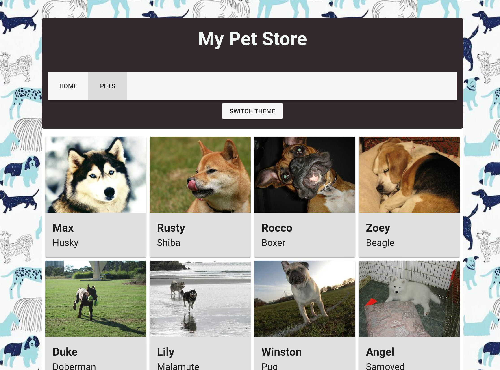

# 📋 Chapter 3: Connect your Project to an API

| **Objetivo do projeto**| Aprender como uma API funciona e como usar em nosso projeto.|
| --------------------------- | -------------------------- |
| **O que você irá aprender**| Usando a [DogCEO API](https://dog.ceo/dog-api/), você irá carregar imagens de cães dinamicamente, ao invés de usar dados falsos.|
| **Ferramentas que você irá usar**| Um navegador moderno como o Google Chrome. Caso esteja usando o Chrome, instale a extensão Vue.js DevTools. Uma conta em CodeSandbox.io. |
| **Tempo estimado** | 1 hora|

## Instruções

Se você precisar reiniciar seu projeto, clone [este repositório](https://github.com/VueVixens/projects/tree/master/chapter-1-end) no Code Sandbox após efetuar o login.

Até agora, colocamos imagens de cães em nossas telas por meio de alguns dados JSON estáticos que importamos para um componente. Isso é ótimo para fins de demonstração, mas na vida real, você quase sempre criará aplicativos da Web que consomem dados reais provenientes de suas próprias fontes de dados, ou externamente, de algum lugar da Internet. Vamos aprender a consumir dados de terceiros.

Para realizar chamadas de API, precisaremos de uma biblioteca chamada [axios](https://github.com/axios/axios). É um cliente HTTP baseado em [Promises](https://developer.mozilla.org/pt-BR/docs/Web/JavaScript/Reference/Global_Objects/Promise) que funciona no navegador e em um ambiente node.js.

::: dica 💡
Originalmente, o Vue tinha sua própria maneira de fazer chamadas API usando ajax mas esse recurso foi preterido, pois a biblioteca independente do Axios funcionou muito bem para esse propósito, eliminando a necessidade de uma solução integrada. Leia mais sobre esta decisão [aqui](https://medium.com/the-vue-point/retiring-vue-resource-871a82880af4).
:::

## Adicionando o Axios

Primeiro, adicione a biblioteca do Axios às dependências do seu projeto. Para fazer isso no Code Sandbox, clique na aba `File Editor` -> `Dependencies` -> `Add Dependency` e procure por `axios`

Importe o Axios para o componente onde executaremos nossa chamada API - `views/Pets.vue`. No bloco de script desse componente, adicione esta linha:

```js
import axios from "axios";
```

Todas as nossas chamadas usarão a mesma URL de base com diferentes endpoints. Logo abaixo da importação para os axios, adicione o URL base às opções do Axios:

```js
axios.defaults.baseURL = "https://dog.ceo/api";
```

Agora estamos prontos para fazer nossa primeira chamada de API.

## Chamando a API

Vamos substituir a primeira imagem estática pela imagem aleatória de Husky da API Dog CEO. Primeiro temos que verificar qual endpoint nós temos que usar. Olhando para a documentação [da API](https://dog.ceo/dog-api/) podemos descobrir que precisamos acrescentar `/breed/husky/images/random` à chamada da API (a parte `api` já está na nossa URL base).

Queremos que uma nova imagem substitua a antiga corretamente quando o componente é criado, então vamos adicionar um hook `created ()` logo após `data`:

```js
created() {}
```

::: tip 💡
Nota: Certifique-se de adicionar uma vírgula após o objeto de dados e, em seguida, adicione o `created ()`!
:::

::: tip 💡
Este é o primeiro hook de lifecycle do nosso aplicativo! Estes são muito úteis quando você quer um bom controle sobre quando executar blocos de código. Leia mais [aqui](https://vuejs.org/v2/guide/instance.html#Instance-Lifecycle-Hooks)
:::

Dentro do hook criado, adicionaremos nossa primeira consulta à API. Para executar uma requisição GET, o Axios usa o método `axios.get`. O resultado será uma promise de JavaScript, portanto, temos que fornecer retornos de sucesso e falha a ela. Por enquanto, vamos simplesmente imprimir o resultado da consulta no console. Edite `created () {}` colocando este trecho entre as chaves:

```js
  axios
    .get("/breed/husky/images/random")
    .then(response => {
      console.log(response);
    })
    .catch(error => {
      console.log(error);
    });
```

Na visualização do navegador no Code Sandbox, vá para a guia Pets. Você deve ver um objeto no seu console. Dê uma olhada melhor clicando na seta à esquerda. Estamos interessadas ​​em seu campo `data`. Você pode ver que temos um status `success` e uma mensagem com um URL de imagem (você pode copiar/colar no seu navegador e descobrir um Husky bonito).

## Use a API 1 - Substitua alguns dos dados estáticos

Vamos substituir nossa imagem Husky por essa nova. Primeiro, devemos encontrar um Husky em nosso array de cães com um método `Array.find`. Ele irá verificar os itens do array `dogs` (que já estamos carregando no componente pelo arquivo de dados `data/dogs.js`) um por um para encontrar o primeiro item correspondente aos critérios fornecidos. No nosso caso, o critério é uma "raça" igual a "husky". Substitua o `console.log ()` dentro do callback `then` na chamada do Axios que acabamos de implementar por esta string:

```js
const husky = this.dogs.find(dog => dog.breed === 'husky');
console.log(husky);
```

Ok, nós encontramos um husky que você pode ver no `console.log ()`. Você também pode vê-lo na página "Pets" do seu aplicativo. Procure "Max", listado como um husky. Agora vamos fornecer a ele uma nova imagem reatribuindo a URL da imagem dos dados estáticos pelos dados provenientes da API. Adicione esta linha abaixo do trecho que você acabou de adicionar.

```js
husky.img = response.data.message;
```

Você deve ver a imagem mudar para uma imagem aleatória de um husky extraída da API Dog CEO.

## Use a API 2 - Randomize as Imagens

Vamos tentar carregar uma imagem aleatória para cada cachorro em nosso array `dogs`. A primeira coisa que precisamos é de um endpoint adequado para cada raça que temos. Vamos criar um array de links usando o método `.map`.

::: dica 💡
O método `.map()` cria um novo array com os resultados de uma função, aplicada a cada elemento do array original.
:::

Sobrescreva todo o código no `Created ()` criando esta constante de linksArray:

```js
const linksArray = this.dogs.map(
   dog => "/breed/" + dog.breed + "/images/random"
);
```

Estamos pegando a raça de cada cão no array e inserindo-o dentro da string do endpoint que iremos chamar (usamos o mesmo anteriormente para o husky, mas `breed` foi usado como um valor estático lá).

Neste ponto, temos que executar várias chamadas de API usando todos os links que acabamos de criar - tantas chamadas de API quanto existem em nossos dados estáticos. O Axios tem uma função auxiliar para este caso chamada `axios.all` e `axios.spread`. Nós forneceremos uma série de nossos pedidos para `axios.all`, que retornará uma matriz de respostas e devemos usar o `axios.spread` para "espalhar" este array em múltiplos argumentos. Para criar uma matriz de consultas, usaremos um método `.map` em nosso `linksArray`, executando `axios.get` para cada link. Adicione este snippet diretamente abaixo do snippet linksArray adicionado pouco antes.

```js
axios.all(linksArray.map(link => axios.get(link)))
   .then(
     axios.spread((...res) => {
       this.dogs.forEach((dog, index) => {
         dog.img = res[index].data.message;
       });
     })
   );
```

::: tip 💡
O que esta acontecendo aqui? O método `forEach()` executa uma função fornecida uma vez para cada elemento do array em linksArray. Basicamente, ele passa pelos dados estáticos e adiciona uma das imagem aleatórias da API a `this.dogs`, assim que tivermos a resposta da nossa API. Então nós estamos substituindo cada imagem de cão qe temos originalmente por uma nova correspondente da API (`index` é o índice do elemento atual sendo processado no array, é o mesmo para os dois arrays porque os objetos de resposta são colocados na mesma ordem em que foram enviados).
:::

Agora temos novas imagens toda vez que nosso componente `Pets` é criado (você pode ver as imagens mudarem na atualização da página ou simplesmente mudando as abas de `pets` para `home` e vice-versa). Os nomes e raças dos cães ainda estão sendo extraídos de dados estáticos, mas as imagens são provenientes da API, combinadas com a raça do cão estático.

O único problema remanescente é que ainda podemos ver as imagens antigas por um breve momento quando entramos na página Pets. Vamos limpar as imagens dos cachorros antes de realizarmos uma consulta. Adicione esta string como a primeira dentro do hook `created ()`:

```js
this.dogs.forEach(dog => {
     dog.img = "";
});
```

**Agora, inicialmente, vemos retratos vazios de cachorros e, em seguida, as imagens são carregadas a partir da API. Progresso!**

# Resultado final

